# アーキテクチャ

## 全体アーキテクチャ

Chrome 拡張機能の全体構成を示します。GitHub ページの検出から、XAML のパース、ビジュアライザーパネルの表示までの関係を表しています。

## データフロー

XAML ファイルの検出から画面表示までの具体的な処理の流れです。

## 主要コンポーネント

| コンポーネント | 役割 |
|-------------|------|
| **Content Script** | GitHub ページに注入され、ページ種別の検出・ボタン注入・表示の制御を行う |
| **Parser モジュール** | XAML テキストを読み解き、Activity ツリーに変換する |
| **Renderer モジュール** | Activity ツリーから HTML のカード表示や差分ハイライトを生成する |
| **サポートモジュール** | 多言語対応（日英）やアクティビティ別プロパティ設定を管理する |

## 図の編集

アーキテクチャ図の元ファイルは [`docs/architecture.drawio`](https://github.com/AutoFor/uipath-xaml-visualizer/blob/master/docs/architecture.drawio) にあります。draw.io で直接編集できます。
