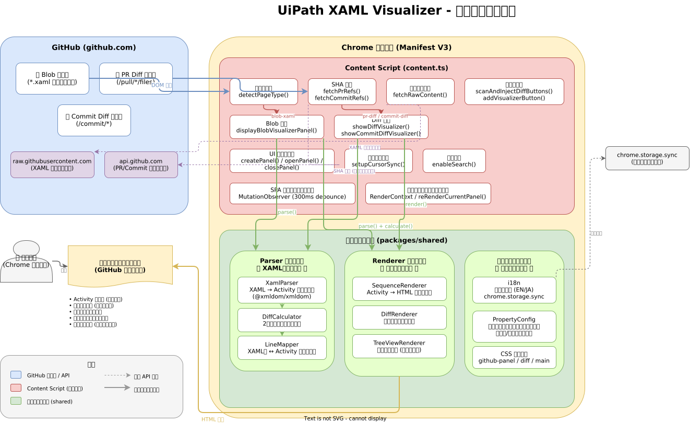

# Architecture | アーキテクチャ

## Overall Architecture | 全体アーキテクチャ

The overall structure of the Chrome extension is shown below, from GitHub page detection through XAML parsing to visualizer panel display.

Chrome 拡張機能の全体構成を示します。GitHub ページの検出から、XAML のパース、ビジュアライザーパネルの表示までの関係を表しています。


## Data Flow | データフロー

The concrete processing flow from XAML file detection to display.

XAML ファイルの検出から画面表示までの具体的な処理の流れです。



## Key Components | 主要コンポーネント

| Component | Role |
|-----------|------|
| **Content Script** | Injected into GitHub pages; detects page type, injects buttons, controls display |
| **Parser module** | Reads XAML text and converts it to an Activity tree |
| **Renderer module** | Generates HTML card views and diff highlights from the Activity tree |
| **Support modules** | Manages multilingual support (EN/JA) and per-activity property configuration |

| コンポーネント | 役割 |
|-------------|------|
| **Content Script** | GitHub ページに注入され、ページ種別の検出・ボタン注入・表示の制御を行う |
| **Parser モジュール** | XAML テキストを読み解き、Activity ツリーに変換する |
| **Renderer モジュール** | Activity ツリーから HTML のカード表示や差分ハイライトを生成する |
| **サポートモジュール** | 多言語対応（日英）やアクティビティ別プロパティ設定を管理する |

## Package Structure | パッケージ構成

```
uipath-xaml-visualizer/
├── packages/
│   ├── shared/                    # Shared library (parser + renderer)
│   │   ├── parser/
│   │   │   ├── xaml-parser.ts     # XAML → Activity tree
│   │   │   ├── diff-calculator.ts # Diff calculation
│   │   │   └── line-mapper.ts     # Line number mapping
│   │   ├── renderer/
│   │   │   ├── sequence-renderer.ts  # Card-based rendering
│   │   │   ├── diff-renderer.ts      # Diff rendering
│   │   │   ├── tree-view-renderer.ts # Tree view rendering
│   │   │   └── property-config.ts    # Property configuration
│   │   ├── i18n/
│   │   │   └── i18n.ts            # EN/JA translation
│   │   └── index.ts               # Public exports
│   └── github-extension/          # GitHub Chrome extension
│       └── src/
│           └── content.ts         # Content script (entry point)
└── docs/wiki/                     # Documentation
```

## Editing Diagrams | 図の編集

The source file for the architecture diagrams is at [`docs/architecture.drawio`](https://github.com/AutoFor/uipath-xaml-visualizer/blob/master/docs/architecture.drawio) and can be edited directly with draw.io.

アーキテクチャ図の元ファイルは [`docs/architecture.drawio`](https://github.com/AutoFor/uipath-xaml-visualizer/blob/master/docs/architecture.drawio) にあります。draw.io で直接編集できます。

## See Also | 関連ページ

- [Parser](Parser) - Parser module details
- [Renderer](Renderer) - Renderer module details
- [GitHub-Extension](GitHub-Extension) - Content script details
- [i18n](i18n) - Internationalization details
