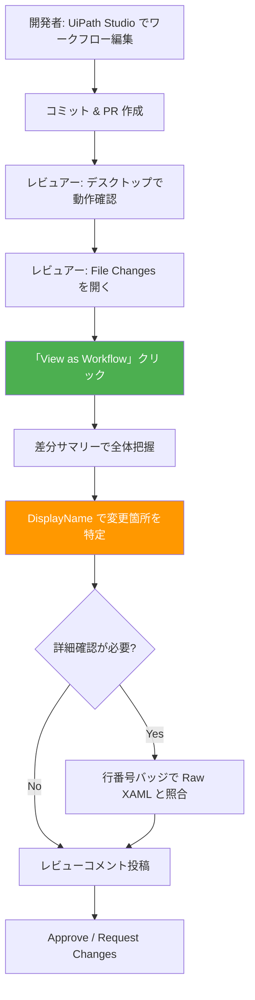
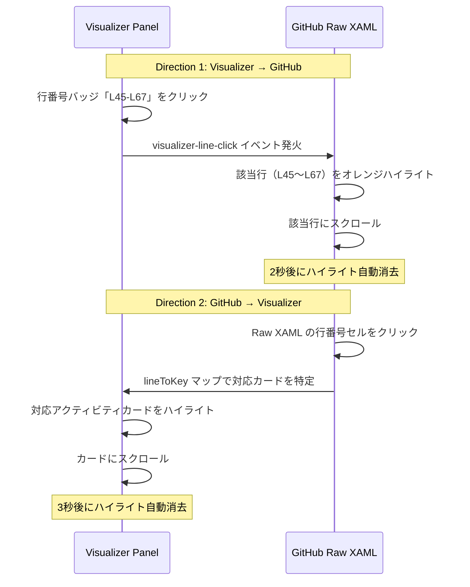

# PR Review Workflow

PR レビューにおけるこの拡張機能の役割と、開発者・レビュアーそれぞれの動き方を整理する。

## 全体フロー



---

## 開発者側のフロー

### 1. ワークフロー編集

UiPath Studio でワークフローを編集する。通常の開発作業。

### 2. コミット & PR 作成

`.xaml` ファイルをコミットして PR を作成する。

> **ポイント**: レビュアーが追いやすい PR にするコツは [Tips](./Tips-and-Best-Practices.md#レビューしやすい-pr-の作り方) を参照。

### 3. レビュー対応

レビュアーからのコメントに対応する。コメントが Raw XAML の行番号に紐づいているため、カーソル同期で Visualizer 側から該当箇所をすぐに確認できる。

---

## レビュアー側のフロー（ステップバイステップ）

### Step 1: デスクトップで動作確認

PR 通知を受けたら、まずブランチをチェックアウトして UiPath Studio でワークフローを実行。動作面の確認を行う。

### Step 2: File Changes を開く

GitHub の PR ページで「Files changed」タブを開く。`.xaml` ファイルの diff が表示される。

### Step 3: 「View as Workflow」をクリック

各 `.xaml` ファイルのヘッダーに「**View as Workflow**」ボタンが注入されている。クリックすると、ページ右側にビジュアライザーパネルが開く。

```
┌─────────────────────────────────────────────────────────┐
│ GitHub PR - Files changed                               │
│                                                         │
│ ┌──────────────────────┐  ┌──────────────────────────┐  │
│ │ Raw XAML diff         │  │ Visualizer Panel         │  │
│ │                       │  │                          │  │
│ │ <Sequence ...>        │  │ ┌─ 差分サマリー ────────┐ │  │
│ │   <Assign ...>        │  │ │ 追加: 2  削除: 1     │ │  │
│ │   ...                 │  │ │ 変更: 3              │ │  │
│ │                       │  │ └──────────────────────┘ │  │
│ │                       │  │                          │  │
│ │                       │  │ [=] Assign: 変数A  +追加 │  │
│ │                       │  │ [?] If: 条件分岐    ~変更 │  │
│ │                       │  │ ...                      │  │
│ └──────────────────────┘  └──────────────────────────┘  │
└─────────────────────────────────────────────────────────┘
```

### Step 4: 差分サマリーで全体把握

パネル上部に表示される差分サマリーを確認する:

- **追加**: 新しく追加されたアクティビティの数
- **削除**: 削除されたアクティビティの数
- **変更**: プロパティが変更されたアクティビティの数

### Step 5: DisplayName で変更箇所を特定（キーポイント）

各アクティビティカードは `type: DisplayName` 形式で表示される。レビュアーは UiPath Studio で見慣れた DisplayName をもとに、何が変わったかを把握する。

- **追加** カードは緑背景 + `+ 追加` バッジ
- **削除** カードは赤背景 + `- 削除` バッジ
- **変更** カードは黄背景 + `~ 変更` バッジ
- DisplayName 自体が変更された場合: `旧名 → 新名` と表示

検索バー（Ctrl+F）で DisplayName をインクリメンタル検索できる。

### Step 6: カーソル同期で Raw XAML と照合

気になるアクティビティがあれば、行番号バッジ（`L45-L67`）をクリックする。Raw XAML の該当行がオレンジ色にハイライトされ、自動スクロールする。

逆方向も可能: Raw XAML の行番号をクリックすると、Visualizer 側の対応カードがハイライトされる。

### Step 7: レビューコメント投稿

2 つの方法でコメントできる:

1. **Visualizer 上から**: カードの `[+]` ボタンでコメント入力フォームを開いて投稿
2. **Raw XAML 上から**: GitHub 標準のインラインコメント機能を使用

Visualizer 上のコメントは GitHub API 経由で投稿され、Raw XAML の該当行に紐づく。

---

## カーソル同期の双方向イメージ



### 同期の仕組み（概要）

1. XAML パース時に `XamlLineMapper` が各アクティビティと行番号の対応表（`ActivityLineIndex`）を構築
2. Visualizer 側のカードには `data-activity-key` 属性が付与される
3. 行番号バッジのクリックで `visualizer-line-click` カスタムイベントが発火し、GitHub 側の行をハイライト
4. GitHub 側の行番号クリックで `lineToKey` マップを逆引きし、Visualizer カードをハイライト

---

## Blob ページでの利用

PR の diff だけでなく、個別の `.xaml` ファイルページ（blob ページ）でも「View as Workflow」ボタンが表示される。クリックすると、ワークフローの構造をカード形式で閲覧でき、カーソル同期も有効になる。

[← Home に戻る](./Home.md)
