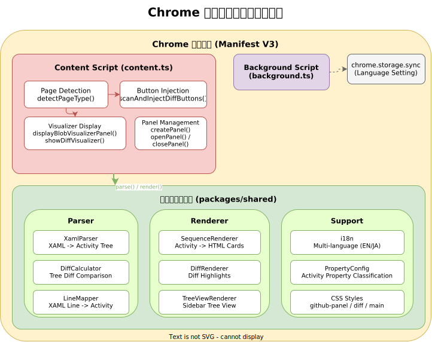
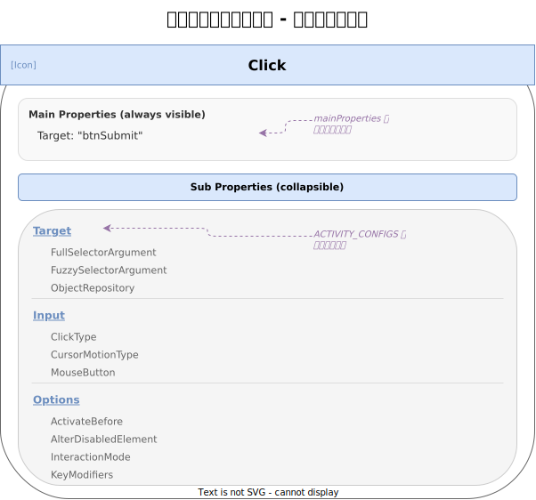
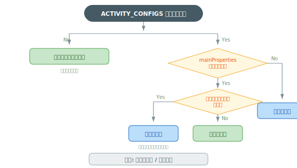

# Property System | プロパティ・サブプロパティの仕組み

## Overview
In UiPath XAML Visualizer, properties (configuration values) of each activity are classified into two layers: **main properties** and **sub-properties**. Important information is shown directly on the card, while detailed settings are placed inside a collapsible panel, balancing visibility and information density.

## 概要
UiPath XAML Visualizer では、各アクティビティが持つプロパティ（設定値）を **メインプロパティ** と **サブプロパティ** の 2 層に分類して表示します。重要な情報はカード上にすぐ見える形で、詳細設定は折りたたみパネルの中に配置することで、視認性と情報量のバランスを取っています。



*[draw.io source](wiki-diagrams.drawio)*

---

## Property Classification | プロパティの分類

All properties are classified into one of the following three categories:

すべてのプロパティは、以下の 3 つのカテゴリに分類されます。

| Category | Display Location | Examples |
|----------|-----------------|---------|
| **Main properties** | Shown directly on the card | `Target`, `To`, `Value`, `Message` |
| **Sub-properties** | Shown inside collapsible panel | `ClickType`, `InteractionMode`, `DelayBefore` |
| **Hidden properties** | Not displayed | `sap:VirtualizedContainerService.HintSize`, `xmlns:ui` |

| カテゴリ | 表示場所 | 例 |
|---------|---------|-----|
| **メインプロパティ** | カード上に直接表示 | `Target`, `To`, `Value`, `Message` |
| **サブプロパティ** | 折りたたみパネル内に表示 | `ClickType`, `InteractionMode`, `DelayBefore` |
| **非表示プロパティ** | 表示しない | `sap:VirtualizedContainerService.HintSize`, `xmlns:ui` |

### Main Properties | メインプロパティ

The **most important configuration values** of an activity. Always shown on the card, enabling a quick overview of the workflow flow.

Which properties become main properties is defined per activity in `ACTIVITY_CONFIGS` in `property-config.ts`.

アクティビティの**最も重要な設定値**です。カード上に常に表示され、ワークフローの流れを一目で把握できます。

どのプロパティがメインになるかは、アクティビティごとに `property-config.ts` の `ACTIVITY_CONFIGS` で定義されています。

### Sub-properties | サブプロパティ

**Supplementary configuration values** beyond the main properties. Displayed inside the collapsible panel ("Properties" button), grouped by category.

メインプロパティ以外の**補助的な設定値**です。折りたたみパネル（「プロパティ」ボタン）の中にグループ分けされて表示されます。

### Hidden Properties | 非表示プロパティ

XAML internal metadata and other properties that users do not need to see. Properties with the following prefixes are automatically excluded:

XAML の内部メタデータなど、ユーザーが見る必要のないプロパティです。以下のプレフィックスで始まるものが自動的に除外されます。

| Prefix | Meaning |
|--------|---------|
| `sap:` | System.Activities.Presentation namespace |
| `sap2010:` | System.Activities.Presentation 2010 namespace |
| `xmlns` | XML namespace declarations |
| `mc:` | Markup Compatibility namespace |
| `mva:` | Microsoft.VisualBasic.Activities namespace |

| プレフィックス | 意味 |
|--------------|------|
| `sap:` | System.Activities.Presentation 名前空間 |
| `sap2010:` | System.Activities.Presentation 2010 名前空間 |
| `xmlns` | XML 名前空間宣言 |
| `mc:` | Markup Compatibility 名前空間 |
| `mva:` | Microsoft.VisualBasic.Activities 名前空間 |

Additionally, the following property names are individually excluded:

さらに、以下のプロパティ名も個別に除外されます。

| Property name | Reason |
|--------------|--------|
| `DisplayName` | Already shown in the card header |
| `Body` | Activity container (rendered as child elements) |
| `ScopeGuid`, `ScopeIdentifier` | Internal management IDs |
| `Version` | Internal version information |
| `AssignOperations` | Processed by MultipleAssign's dedicated rendering |
| `VerifyOptions` | Composite object (verbose when expanded) |

| プロパティ名 | 理由 |
|-------------|------|
| `DisplayName` | カードのヘッダーに表示済み |
| `Body` | アクティビティコンテナ（子要素として描画） |
| `ScopeGuid`, `ScopeIdentifier` | 内部管理用 ID |
| `Version` | 内部バージョン情報 |
| `AssignOperations` | MultipleAssign の専用レンダリングで処理 |
| `VerifyOptions` | 複合オブジェクト（展開すると冗長） |

---

## Display Classification Flow | 表示・非表示の判定フロー

The display destination of properties is determined by the following flow:

プロパティの表示先は、以下のフローで決定されます。



*[draw.io source](wiki-diagrams.drawio)*

---

## Per-Activity Configuration | アクティビティ別の設定

### Activities registered in ACTIVITY_CONFIGS | ACTIVITY_CONFIGS に登録済みのアクティビティ

The following activities have explicitly defined main properties and sub-panel groups:

以下のアクティビティは、メインプロパティとサブパネルのグループが明示的に定義されています。

#### NApplicationCard

| Section | Properties |
|---------|-----------|
| **Main** | `TargetApp` (URL extracted and displayed) |
| **Sub: Target** | `Selector`, `ObjectRepository` |
| **Sub: Input** | `AttachMode` |
| **Sub: Options** | `InteractionMode`, `HealingAgentBehavior` |

| 区分 | プロパティ |
|------|----------|
| **メイン** | `TargetApp`（URL を抽出して表示） |
| **サブ: Target** | `Selector`, `ObjectRepository` |
| **サブ: Input** | `AttachMode` |
| **サブ: Options** | `InteractionMode`, `HealingAgentBehavior` |

#### NClick

| Section | Properties |
|---------|-----------|
| **Main** | `Target` |
| **Sub: Target** | `FullSelectorArgument`, `FuzzySelectorArgument`, `ObjectRepository` |
| **Sub: Input** | `ClickType`, `CursorMotionType`, `MouseButton` |
| **Sub: Options** | `ActivateBefore`, `AlterDisabledElement`, `InteractionMode`, `KeyModifiers` |

| 区分 | プロパティ |
|------|----------|
| **メイン** | `Target` |
| **サブ: Target** | `FullSelectorArgument`, `FuzzySelectorArgument`, `ObjectRepository` |
| **サブ: Input** | `ClickType`, `CursorMotionType`, `MouseButton` |
| **サブ: Options** | `ActivateBefore`, `AlterDisabledElement`, `InteractionMode`, `KeyModifiers` |

#### NTypeInto

| Section | Properties |
|---------|-----------|
| **Main** | `Target`, `Text` |
| **Sub: Input** | `ClickType`, `MouseButton`, `KeyModifiers` |
| **Sub: Options** | `ActivateBefore`, `InteractionMode`, `EmptyField`, `DelayBetweenKeys`, `DelayBefore`, `DelayAfter` |

| 区分 | プロパティ |
|------|----------|
| **メイン** | `Target`, `Text` |
| **サブ: Input** | `ClickType`, `MouseButton`, `KeyModifiers` |
| **サブ: Options** | `ActivateBefore`, `InteractionMode`, `EmptyField`, `DelayBetweenKeys`, `DelayBefore`, `DelayAfter` |

#### NGetText

| Section | Properties |
|---------|-----------|
| **Main** | `Target`, `Value` |
| **Sub: Options** | `ActivateBefore`, `InteractionMode` |

| 区分 | プロパティ |
|------|----------|
| **メイン** | `Target`, `Value` |
| **サブ: Options** | `ActivateBefore`, `InteractionMode` |

### Activities with Dedicated Rendering | 専用レンダリングのアクティビティ

The following activities use dedicated rendering logic without using `ACTIVITY_CONFIGS`:

以下のアクティビティは、ACTIVITY_CONFIGS を使わず、専用のレンダリングロジックを持っています。

| Activity | Display method | Sub-panel |
|----------|---------------|-----------|
| **Assign** | Shown in `To = Value` assignment expression format | None |
| **MultipleAssign** | Lists each assignment expression in `AssignOperations` | None |
| **LogMessage** | Shows only `Level` and `Message` | Yes |

| アクティビティ | 表示方法 | サブパネル |
|--------------|---------|-----------|
| **Assign** | `To = Value` の代入式形式で表示 | なし |
| **MultipleAssign** | `AssignOperations` の各代入式を一覧表示 | なし |
| **LogMessage** | `Level` と `Message` のみ表示 | あり |

### Default Configuration | デフォルト設定（上記以外の定義済みアクティビティ）

Activities not registered in `ACTIVITY_CONFIGS` but judged as defined (N-prefix, etc.) apply the following default main properties:

`ACTIVITY_CONFIGS` に未登録だが定義済みと判定されるアクティビティ（N プレフィックス等）は、以下のデフォルトメインプロパティが適用されます。

```
To, Value, Condition, Selector, Message
```

Properties matching these are shown in the main area; others go to the sub-panel (no grouping).

これらに該当するプロパティがメインに、それ以外がサブパネルに表示されます（グループ分けなし）。

---

## Defined Activity Determination | 定義済みアクティビティの判定

Determined by the `isDefinedActivity()` function. An activity is "defined" if any of the following apply:

`isDefinedActivity()` 関数で判定されます。以下のいずれかに該当すると「定義済み」です。

| Condition | Example |
|-----------|---------|
| Is `Assign` | Assign |
| Is `MultipleAssign` | MultipleAssign |
| Is `LogMessage` | LogMessage |
| Registered in `ACTIVITY_CONFIGS` | NClick, NTypeInto, NGetText, NApplicationCard |
| Starts with `N` | NMessageBox, NDelay, etc. (modern activities) |

| 条件 | 例 |
|------|-----|
| `Assign` | Assign |
| `MultipleAssign` | MultipleAssign |
| `LogMessage` | LogMessage |
| `ACTIVITY_CONFIGS` に登録 | NClick, NTypeInto, NGetText, NApplicationCard |
| `N` で始まる | NMessageBox, NDelay 等のモダンアクティビティ |

**Undefined activities** (not matching any of the above) have both properties and sub-panel completely hidden. If all child elements are also undefined, they are hidden too.

**未定義アクティビティ**（上記に該当しないもの）は、プロパティとサブパネルが完全に非表示になります。さらに、子要素も全て未定義であれば、子要素も非表示になります。

---

## Property Classification in Diff View | 差分表示でのプロパティ分類

In PR and commit diff views, changed properties are classified into **main changes** and **sub changes**.

PR やコミットの差分表示では、変更があったプロパティを**メイン変更**と**サブ変更**に分類します。

### Classification Rules | 分類ルール



*[draw.io source](wiki-diagrams.drawio)*

**Key point**: Even if a property is a main property, if its value is an object type (composite structure containing `Selector`, `Reference`, etc. inside `Target`), it is moved to the sub-panel to avoid noise when expanded.

**ポイント**: メインプロパティであっても、値がオブジェクト型（`Target` の中に `Selector`, `Reference` 等を含む複合構造）の場合は、展開するとノイズが多いためサブパネルに移動します。

---

## Related Files | 関連ファイル

| File | Role |
|------|------|
| `packages/shared/renderer/property-config.ts` | Property classification configuration and determination logic |
| `packages/shared/renderer/sequence-renderer.ts` | Main property and sub-panel rendering |
| `packages/shared/parser/xaml-parser.ts` | Property extraction from XAML |
| `packages/github-extension/src/content.ts` | Property classification calls in diff display |

## See Also | 関連ページ

- [Renderer](Renderer) - Overall renderer module documentation
- [Parser](Parser) - How properties are extracted from XAML
